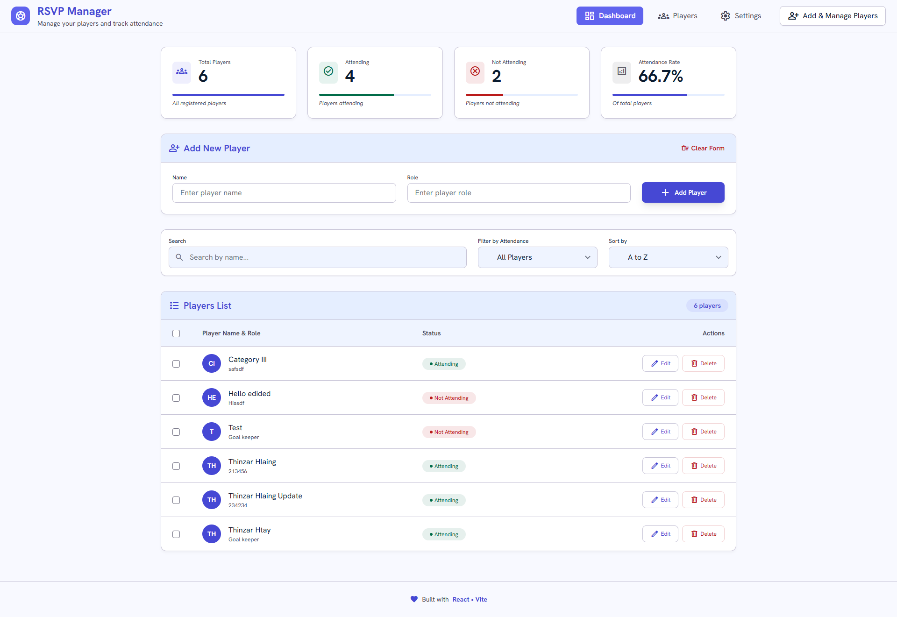

# RSVP Manager App

A simple RSVP manager built with React and Vite for managing players and tracking attendance.

## Features

* Add, edit, and delete players
* Mark players as attending or not attending
* Search players by name
* Filter by attendance status
* Sort players alphabetically or by attendance
* View attendance statistics
* Persist data using Local Storage
* Responsive and modern UI

## Built With

* React
* Vite
* JavaScript
* CSS
* Local Storage

## Screenshot



## Getting Started

Clone the repository:

```bash
git clone https://github.com/tzh19/rsvp-manager-app.git
```

Go to the project directory:

```bash
cd rsvp-manager-app
```

Install dependencies:

```bash
npm install
```

Start the development server:

```bash
npm run dev
```

Build for production:

```bash
npm run build
```

## Learning Notes

This project was created as part of my React learning journey. During development, I learned about:

* React components and props
* Component composition
* State management with `useState`
* Side effects with `useEffect`
* Form validation
* Search, filter, and sorting logic
* Persisting data with Local Storage

## AI Assistance

The UI design and part of the HTML structure were generated with Google Stitch.

I also used ChatGPT and DeepSeek as learning assistants for:

* Understanding React concepts
* Refactoring components
* Improving the UI and CSS
* Debugging issues
* Getting feedback and explanations

All code was reviewed, modified, and integrated as part of my learning process.

## License

This project is for learning and personal practice.
